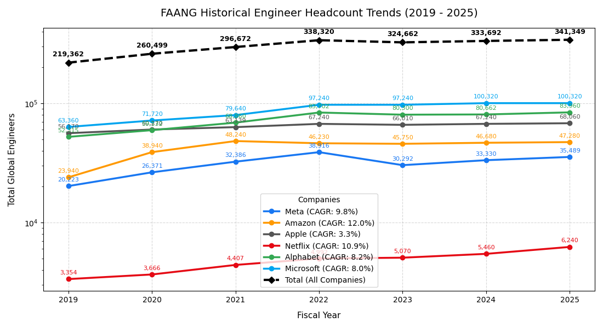
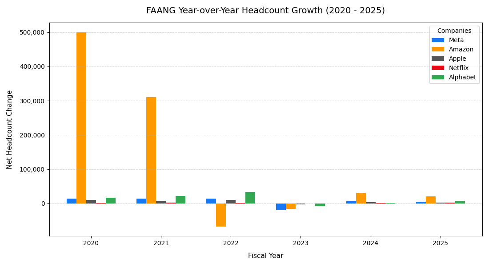

# FAANG-growth: Tech Company Engineering Headcount Analysis

<p align="center">
<a href="https://github.com/ishandutta2007/Awesome-Awesome-Awesome"></a><a href="https://discord.gg/jc4xtF58Ve"></a><a href="https://github.com/ishandutta2007"></a>
</p>
<p align="center">
  
</p>

This repository analyzes the historical headcount trends for top tech companies (FAANG + Microsoft) between 2019 and 2025. Specifically, it subsets the data to estimate and visualize the number of software engineers at each company.

## ✨ Features & Calculations 📊
- 👩‍💻 **Engineer Subset Data:** Loads historical global headcount data for Meta, Amazon, Apple, Netflix, Alphabet, and Microsoft, and filters for engineers using estimated percentage distributions.
- **CAGR Calculation:** Automatically calculates the Compound Annual Growth Rate (CAGR) for the engineer headcount from 2019 to 2025.
- **Global Totals:** Tracks and plots a combined total showing the aggregate engineering talent pool across all six companies for each year.
- **YoY Growth Bar Charts:** Calculates the Year-over-Year (YoY) net change in headcounts and plots the deltas on a grouped bar chart.

## 🖼️ Generated Assets 🚀

### Historical Engineer Headcount Trends
This line plot maps out the engineer headcount trends for each individual company, alongside a dashed black trendline showing the combined Total. All data points are annotated, and the legend includes the 6-year CAGR for each company.


### Year-over-Year Engineer Growth
This grouped bar chart visualizes the net annual changes in engineering headcounts, providing a clear comparison of each company's hiring or contraction from year to year.


## 💻 Usage 🔧

Simply run the Python script to execute the calculations, view the interactive plots, and automatically export these images into the `assets` folder.

```bash
python FAANG-growth.py
```

## ⭐️ Star History
<div align="center">
<a href="https://www.star-history.com/?repos=ishandutta2007%2FFAANG-growth&type=date&legend=bottom-right">
<picture>
<source media="(prefers-color-scheme: dark)" srcset="https://api.star-history.com/chart?repos=ishandutta2007/FAANG-growth&type=date&theme=dark&legend=bottom-right" />
<source media="(prefers-color-scheme: light)" srcset="https://api.star-history.com/chart?repos=ishandutta2007/FAANG-growth&type=date&legend=bottom-right" />

</picture>
</a>
</div>
